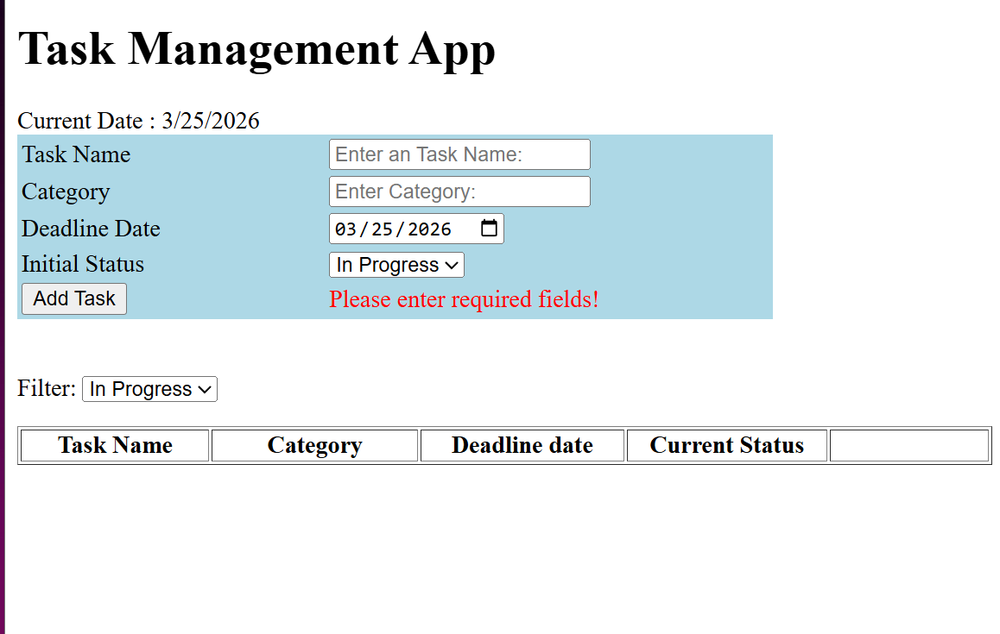

## Table of contents

- [Overview](#overview)
  - [The challenge](#the-challenge)
  - [Screenshot](#screenshot)
  - [Links](#links)
- [My process](#my-process)
  - [Built with](#built-with)
  - [What I learned](#what-i-learned)
  - [Continued development](#continued-development)
  - [Useful resources](#useful-resources)

## Overview

### The challenge

Users should be able to:

Allows users to add tasks with deadlines, assign categories, and update the status of each task. 

### Screenshot

### Links

- Github URL: (https://github.com/Shelley960/SAB-Task-Management-App)

## My process

### Built with

- Semantic HTML5 markup
- CSS custom properties
- Javascript
    - Arrays
    - Objects 
    - DOM manipulation 
    - conditionals

### What I learned

Understand more how to use array, DOM manipulation, and conditionals.  

### Continued development

I need to be more familiar with DOM manipulation and arrays. 

### Useful resources

- [Per Scholas](https://ps-lms.vercel.app/curriculum/se/412) - This helped me understand the basic on how to use Javascript.    
- [w3schools](https://www.ew3schools.com) - This is another good site that help me understand html, css, and javascriptr.

